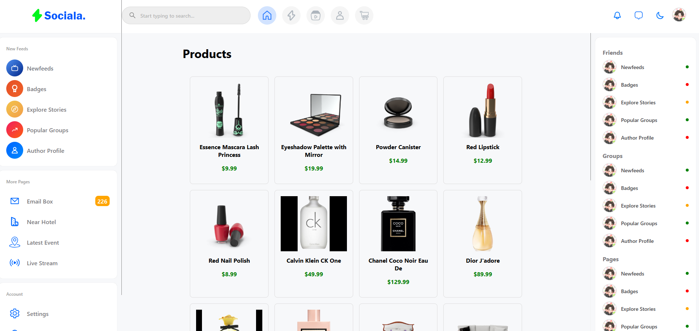

# Product Search App

This project allows users to search for products using an API. The list of products is fetched and displayed with infinite scroll functionality.

## Features

1. Each time the user **scrolls to the end of the list, fetch the next 20 products**.
2. **Display the list of products** with relevant information (e.g., name, price, image).
3. Implement an **input for searching product name** (using */products/search?q* ). 
Whenever user typing, fetch data and update the product list.
4. Products data should be deserialized after fetched from api.

## Requirements

- Node.js (latest)
- npm (>=6)

## Getting Started

1. Clone the repository:

   ```bash
   git clone https://github.com/bao2k1/Scrolling-and-Search.git
2. Install dependencies:

npm install

3. Start the development server:

npm start

